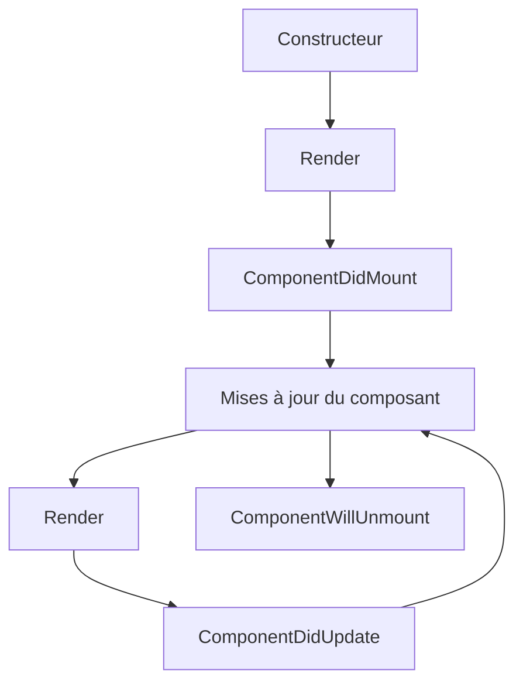

# Fondamentaux de React

## Introduction à React

React est une bibliothèque JavaScript pour construire des interfaces utilisateur, en particulier des applications à page unique. Elle est utilisée pour gérer la couche de vue dans les applications web et mobiles. React vous permet de concevoir des vues simples pour chaque état de votre application, et elle mettra à jour et rendra efficacement les bons composants lorsque vos données changent.

### Caractéristiques clés de React

- **Basé sur les composants** : Créez des composants encapsulés qui gèrent leur propre état
- **Déclaratif** : Concevez des vues simples pour chaque état de votre application
- **Apprenez une fois, écrivez partout** : Développez de nouvelles fonctionnalités sans réécrire le code existant
- **DOM virtuel** : Un concept de programmation où une représentation virtuelle de l'interface utilisateur est conservée en mémoire

## Création de votre premier composant React

Les composants React sont les éléments de base de toute application React. Un composant est une fonction ou une classe JavaScript qui accepte éventuellement des entrées (appelées "props") et renvoie un élément React qui décrit comment une section de l'interface utilisateur doit apparaître.

```jsx
// Un composant fonctionnel simple
function Bienvenue(props) {
  return <h1>Bonjour, {props.nom}</h1>;
}

// Utilisation du composant
const element = <Bienvenue nom="Sara" />;
```

## JSX : JavaScript + XML

JSX est une extension de syntaxe pour JavaScript qui ressemble à HTML. Il est recommandé de l'utiliser avec React pour décrire à quoi l'interface utilisateur devrait ressembler.

```jsx
const element = <h1>Bonjour, monde!</h1>;
```

En coulisses, JSX est transformé en JavaScript régulier :

```javascript
const element = React.createElement('h1', null, 'Bonjour, monde!');
```

## État et cycle de vie

L'état permet aux composants React de modifier leur sortie au fil du temps en réponse aux actions de l'utilisateur, aux réponses réseau et à tout autre changement.

```jsx
class Horloge extends React.Component {
  constructor(props) {
    super(props);
    this.state = {date: new Date()};
  }

  componentDidMount() {
    this.timerID = setInterval(
      () => this.tick(),
      1000
    );
  }

  componentWillUnmount() {
    clearInterval(this.timerID);
  }

  tick() {
    this.setState({
      date: new Date()
    });
  }

  render() {
    return (
      <div>
        <h1>Bonjour, monde!</h1>
        <h2>Il est {this.state.date.toLocaleTimeString()}.</h2>
      </div>
    );
  }
}
```

## Hooks

Les Hooks sont une addition plus récente à React qui vous permettent d'utiliser l'état et d'autres fonctionnalités de React sans écrire une classe.

```jsx
import React, { useState, useEffect } from 'react';

function Exemple() {
  // Déclarer une nouvelle variable d'état, que nous appellerons "compteur"
  const [compteur, setCompteur] = useState(0);

  // Similaire à componentDidMount et componentDidUpdate:
  useEffect(() => {
    // Mettre à jour le titre du document en utilisant l'API du navigateur
    document.title = `Vous avez cliqué ${compteur} fois`;
  });

  return (
    <div>
      <p>Vous avez cliqué {compteur} fois</p>
      <button onClick={() => setCompteur(compteur + 1)}>
        Cliquez-moi
      </button>
    </div>
  );
}
```

## Cycle de vie d'un composant React



## Conclusion

React a révolutionné la façon dont nous construisons les interfaces utilisateur. Son architecture basée sur les composants, son DOM virtuel et son flux de données unidirectionnel en font un excellent choix pour construire des applications web modernes. Au fur et à mesure que vous poursuivrez votre parcours avec React, vous découvrirez des modèles et des techniques plus avancés qui vous aideront à construire des applications encore plus puissantes et efficaces.

---

*Cette conférence fait partie de la série "Développement Frontend".*