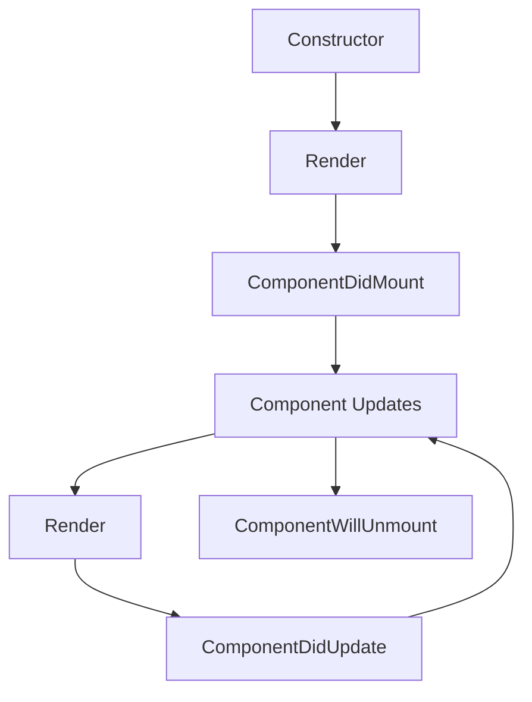

# React Fundamentals

## Introduction to React

React is a JavaScript library for building user interfaces, particularly single-page applications. It's used for handling the view layer in web and mobile applications. React allows you to design simple views for each state in your application, and it will efficiently update and render just the right components when your data changes.

### Key Features of React

- **Component-Based**: Build encapsulated components that manage their own state
- **Declarative**: Design simple views for each state in your application
- **Learn Once, Write Anywhere**: Develop new features without rewriting existing code
- **Virtual DOM**: A programming concept where a virtual representation of a UI is kept in memory

## Creating Your First React Component

React components are the building blocks of any React application. A component is a JavaScript function or class that optionally accepts inputs (called "props") and returns a React element that describes how a section of the UI should appear.

```jsx
// A simple functional component
function Welcome(props) {
  return <h1>Hello, {props.name}</h1>;
}

// Using the component
const element = <Welcome name="Sara" />;
```

## JSX: JavaScript + XML

JSX is a syntax extension to JavaScript that looks similar to HTML. It's recommended to use it with React to describe what the UI should look like.

```jsx
const element = <h1>Hello, world!</h1>;
```

Behind the scenes, JSX is transformed into regular JavaScript:

```javascript
const element = React.createElement('h1', null, 'Hello, world!');
```

## State and Lifecycle

State allows React components to change their output over time in response to user actions, network responses, and anything else.

```jsx
class Clock extends React.Component {
  constructor(props) {
    super(props);
    this.state = {date: new Date()};
  }

  componentDidMount() {
    this.timerID = setInterval(
      () => this.tick(),
      1000
    );
  }

  componentWillUnmount() {
    clearInterval(this.timerID);
  }

  tick() {
    this.setState({
      date: new Date()
    });
  }

  render() {
    return (
      <div>
        <h1>Hello, world!</h1>
        <h2>It is {this.state.date.toLocaleTimeString()}.</h2>
      </div>
    );
  }
}
```

## Hooks

Hooks are a newer addition to React that allow you to use state and other React features without writing a class.

```jsx
import React, { useState, useEffect } from 'react';

function Example() {
  // Declare a new state variable, which we'll call "count"
  const [count, setCount] = useState(0);

  // Similar to componentDidMount and componentDidUpdate:
  useEffect(() => {
    // Update the document title using the browser API
    document.title = `You clicked ${count} times`;
  });

  return (
    <div>
      <p>You clicked {count} times</p>
      <button onClick={() => setCount(count + 1)}>
        Click me
      </button>
    </div>
  );
}
```

## React Component Lifecycle



## Conclusion

React has revolutionized the way we build user interfaces. Its component-based architecture, virtual DOM, and unidirectional data flow make it an excellent choice for building modern web applications. As you continue your journey with React, you'll discover more advanced patterns and techniques that will help you build even more powerful and efficient applications.

---

*This lecture is part of the "Frontend Development" series.*